# Video Game Sales Analytics Pipeline

Pipeline de datos end-to-end sobre AWS que toma el dataset [Video Game Sales](https://www.kaggle.com/datasets/gregorut/videogamesales) directamente desde la API de Kaggle, lo transforma, lo almacena en S3 en formato Parquet, lo cataloga con AWS Glue y lo expone para consultas SQL con Amazon Athena. Los resultados se visualizan en Power BI Desktop mediante una conexion ODBC directa a Athena.

Todo el proceso es automatizado. No hay descargas manuales ni subidas manuales de archivos.

---

## Que construye este proyecto

El pipeline cubre las siguientes etapas:

1. Ingesta desde la API de Kaggle usando credenciales almacenadas de forma segura en AWS Secrets Manager.
2. Transformacion y limpieza del dataset con pandas dentro de un AWS Glue Job.
3. Conversion a formato Parquet con compresion Snappy y almacenamiento en Amazon S3.
4. Catalogacion automatica del esquema con AWS Glue Crawler, que registra la tabla en el Glue Data Catalog.
5. Consultas SQL sobre los datos en S3 usando Amazon Athena, sin necesidad de cargar los datos en una base de datos.
6. Visualizacion de los resultados en Power BI Desktop conectado a Athena via ODBC.

---

## Arquitectura

```
API de Kaggle
    |
    v
AWS Secrets Manager        <- credenciales de Kaggle almacenadas de forma segura
    |
    v
AWS Glue Job (Python Shell)
    |  - Descarga el CSV desde la API de Kaggle
    |  - Limpia y transforma los datos con pandas
    |  - Convierte a Parquet con compresion Snappy
    |
    v
Amazon S3
    raw/videogames/videogames_sales.parquet
    athena-results/
    |
    v
AWS Glue Crawler  -->  Glue Data Catalog (db_videogames)
    |
    v
Amazon Athena              <- consultas SQL directas sobre S3
    |
    v
Power BI Desktop           <- conexion ODBC via Simba Athena Driver
```

---

## Dataset

- Fuente: [Video Game Sales - Kaggle](https://www.kaggle.com/datasets/gregorut/videogamesales)
- Registros: ~16,500 videojuegos
- Campos: `Rank`, `Name`, `Platform`, `Year`, `Genre`, `Publisher`, `NA_Sales`, `EU_Sales`, `JP_Sales`, `Other_Sales`, `Global_Sales`
- Tamano del archivo Parquet generado: ~460 KB

---

## Tecnologias utilizadas

| Servicio / Herramienta       | Rol en el pipeline                                      |
|------------------------------|---------------------------------------------------------|
| AWS Secrets Manager          | Almacenamiento seguro de credenciales de Kaggle         |
| AWS Glue Job (Python Shell)  | Orquestacion ETL: ingesta, transformacion y carga       |
| Amazon S3                    | Almacenamiento de datos en formato Parquet              |
| AWS Glue Crawler             | Inferencia de esquema y registro en el Data Catalog     |
| AWS Glue Data Catalog        | Catalogo de metadatos consultable por Athena            |
| Amazon Athena                | Motor de consultas SQL serverless sobre S3              |
| Power BI Desktop             | Visualizacion de datos via conexion ODBC                |
| Simba Athena ODBC Driver     | Conector entre Power BI y Athena                        |

---

## Requisitos previos

- Cuenta de AWS (el Free Tier es suficiente para este proyecto)
- Cuenta de Kaggle con API key ([obtenerla aqui](https://www.kaggle.com/settings))
- Power BI Desktop instalado (disponible solo en Windows)
- [Simba Athena ODBC Driver](https://docs.aws.amazon.com/athena/latest/ug/connect-with-odbc.html) instalado

---

## Paso a paso

### 1. Guardar credenciales de Kaggle en AWS Secrets Manager

Ve a **AWS Secrets Manager > Almacenar un nuevo secreto > Otro tipo de secreto**.

Agrega dos pares clave-valor:

| Clave      | Valor                |
|------------|----------------------|
| `username` | tu usuario de Kaggle |
| `key`      | tu API key de Kaggle |

Nombre del secreto:
```
kaggle/videogames-credentials
```

El Glue Job lee este secreto en tiempo de ejecucion. Las credenciales nunca se escriben en el codigo ni en parametros visibles del job.

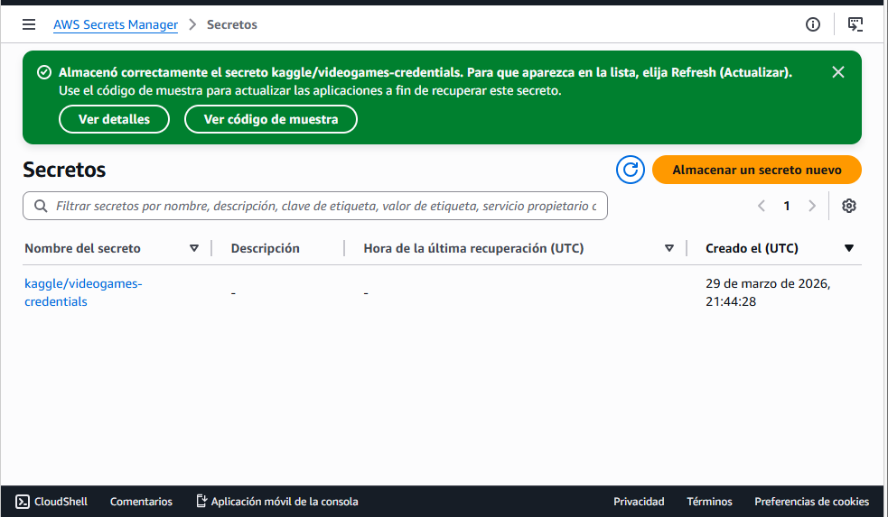

---

### 2. Crear el bucket S3

Crea un bucket en tu region preferida (este proyecto uso `us-east-2`).

Nombre sugerido: `videogames-pipeline-<tus-iniciales>`

No se necesita configuracion especial. Deja el acceso publico bloqueado (configuracion por defecto).

El Glue Job creara automaticamente la siguiente estructura de carpetas:
```
tu-bucket/
├── raw/
│   └── videogames/
│       └── videogames_sales.parquet
└── athena-results/
```

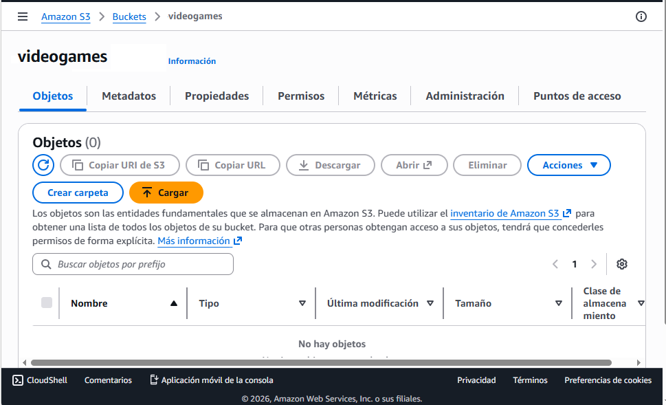

---

### 3. Crear el rol IAM para Glue

Ve a **IAM > Roles > Crear rol**.

- Entidad de confianza: **AWS Glue**
- Politicas a adjuntar:
  - `AWSGlueServiceRole`
  - `AmazonS3FullAccess`
  - `SecretsManagerReadWrite`

Nombre del rol: `GlueRoleVideogamesPipeline`

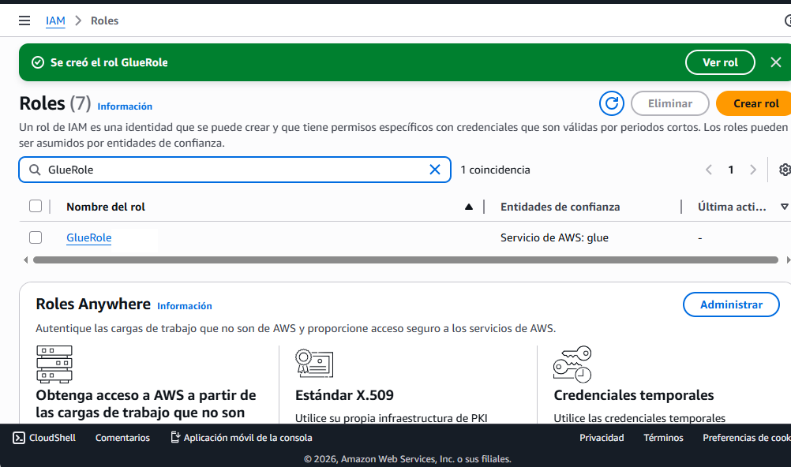

---

### 4. Crear el Glue Job

Ve a **AWS Glue > ETL Jobs > Script editor**.

- Engine: **Python Shell**
- IAM Role: el rol creado en el paso anterior
- DPU: `1/16` (minimo disponible, suficiente para este dataset)
- Glue version: `Glue 3.0`
- Python version: `3.9`

> Selecciona Glue version 3.0 explicitamente. La libreria `awsglue.utils` que usa el script solo esta disponible en Python Shell jobs a partir de esta version. Con versiones anteriores el job fallara al importar el modulo.

Copia el contenido de [`etl/glue_job.py`](etl/glue_job.py) en el editor de scripts.

En **Advanced properties > Job parameters**, agrega los siguientes parametros:

| Clave           | Valor                           |
|-----------------|---------------------------------|
| `--SECRET_NAME` | `kaggle/videogames-credentials` |
| `--S3_BUCKET`   | `nombre-de-tu-bucket`           |
| `--S3_PREFIX`   | `raw/videogames/`               |

En **Additional Python modules**, especifica las versiones exactas:
```
pandas==2.2.2,pyarrow==16.1.0,requests==2.32.3
```

> Fijar las versiones evita incompatibilidades. `pyarrow` en particular introduce breaking changes entre versiones mayores, y sin version fija Glue puede instalar una version diferente a la usada en el desarrollo de este proyecto.

Guarda y ejecuta el job. La ejecucion tarda aproximadamente 2-3 minutos.

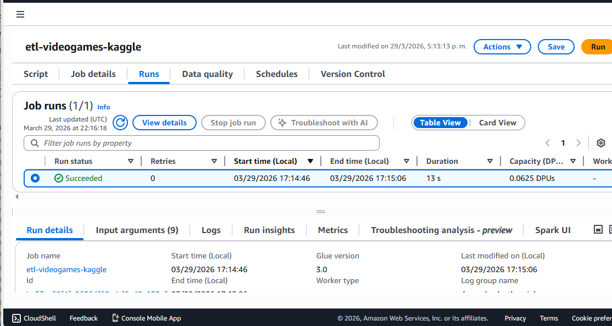

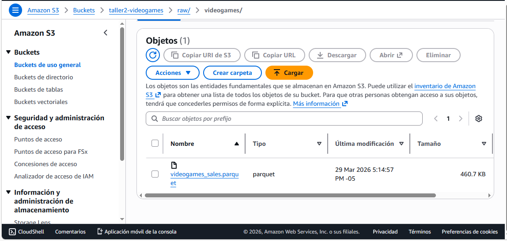

---

### 5. Crear el Glue Crawler

Ve a **AWS Glue > Crawlers > Create crawler**.

- Nombre: `crawler-videogames`
- Fuente de datos: `s3://tu-bucket/raw/videogames/` (apunta a la **carpeta**, no al archivo `.parquet`)
- IAM Role: el mismo rol del Glue Job
- Base de datos de destino: crea una nueva llamada `db_videogames`
- Programacion: On demand

> El Crawler debe apuntar a la carpeta, no al archivo directamente. De esta forma infiere el esquema correctamente y seguira funcionando si el archivo se regenera o si en el futuro se agregan particiones, sin necesidad de modificar la configuracion del Crawler.

Ejecuta el crawler. Termina en aproximadamente 45 segundos y registra la tabla `videogames` en el Glue Data Catalog.

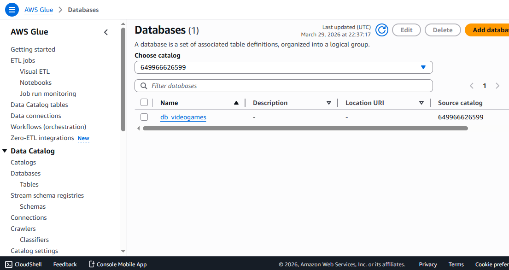

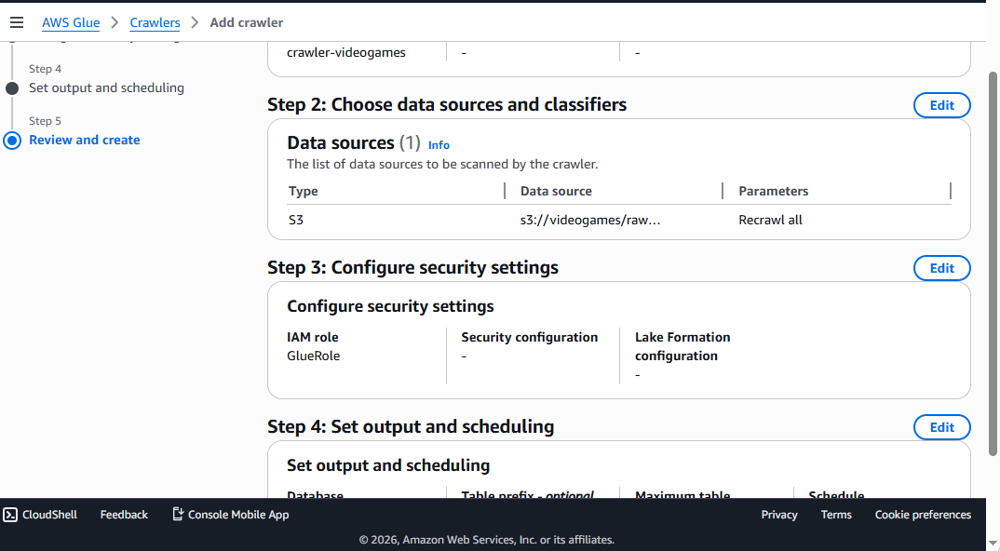

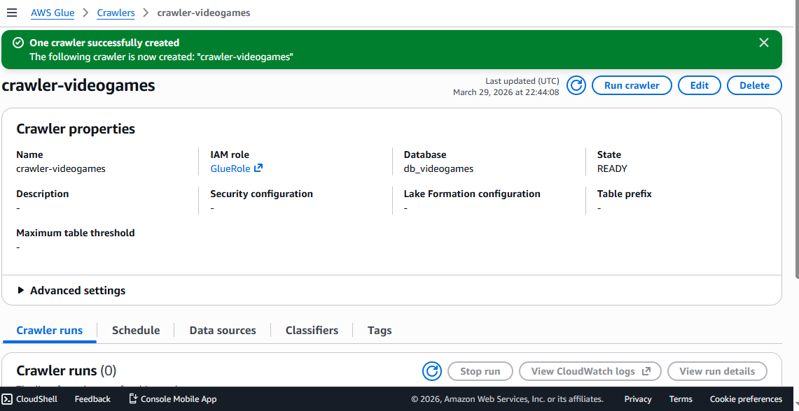

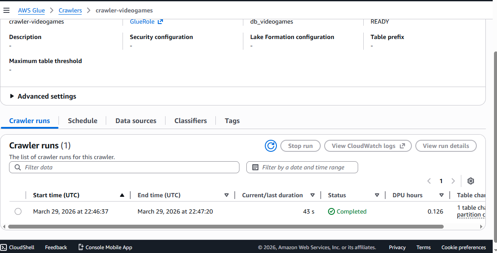

---

### 6. Consultar con Amazon Athena

Ve a **Amazon Athena > Editor de consultas**.

Antes de ejecutar la primera consulta, configura la ubicacion de resultados en **Settings**:
```
s3://tu-bucket/athena-results/
```

Selecciona `db_videogames` como base de datos activa. Puedes validar que todo funciona correctamente con:
```sql
SELECT * FROM videogames LIMIT 10;
```

Las consultas analiticas del proyecto estan en la carpeta [`sql/`](sql/).

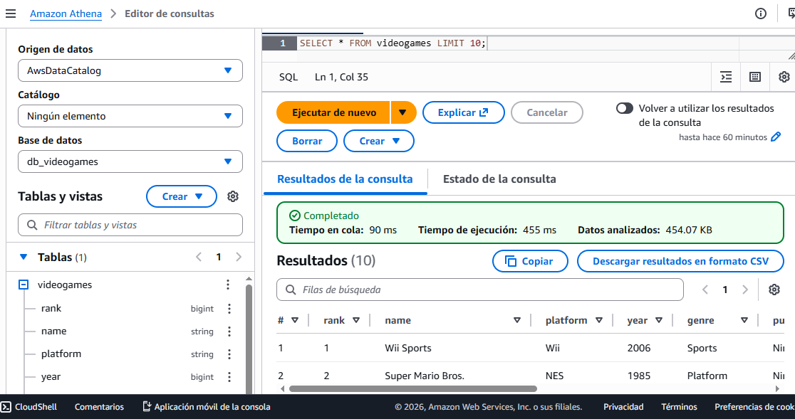

---

### 7. Conectar Power BI via ODBC

Instala el **Simba Athena ODBC Driver** desde la [pagina oficial de AWS](https://docs.aws.amazon.com/athena/latest/ug/connect-with-odbc.html). Descarga el instalador para Windows 64-bit y ejecutalo con la configuracion por defecto.

Abre **Origenes de datos ODBC (64 bits)** en Windows, ve a la pestana **DSN de usuario** y crea un nuevo DSN con los siguientes valores:

| Campo              | Valor                                |
|--------------------|--------------------------------------|
| Data Source Name   | `AthenaVideogames`                   |
| AWS Region         | tu region (ej. `us-east-2`)          |
| Catalog            | `AwsDataCatalog`                     |
| Schema             | `db_videogames`                      |
| Workgroup          | `primary`                            |
| S3 Output Location | `s3://tu-bucket/athena-results/`     |

En **Authentication Options**:

| Campo               | Valor                                        |
|---------------------|----------------------------------------------|
| Authentication Type | `IAM Credentials`                            |
| User                | tu IAM Access Key ID (empieza por `AKIA...`) |
| Password            | tu IAM Secret Access Key                     |

> Este proyecto usa IAM Access Keys de largo plazo para la autenticacion ODBC. Es un metodo funcional para entornos de aprendizaje y uso personal, pero no es el unico disponible. Existen alternativas como roles IAM con sesiones temporales (AWS STS) o AWS IAM Identity Center que son mas adecuadas para entornos compartidos o productivos. Ver [`docs/iam-user-for-odbc.md`](docs/iam-user-for-odbc.md) para instrucciones detalladas sobre como crear el usuario IAM y consideraciones de seguridad.

Haz clic en **Test**. Si el resultado es `SUCCESS!`, guarda el DSN.

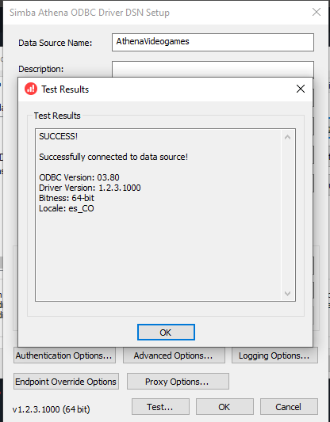

En Power BI Desktop ve a **Inicio > Obtener datos**, busca **Amazon Athena**, ingresa el DSN `AthenaVideogames` y conecta.

Para cargar cada consulta como un dataset independiente, usa **Obtener datos > Amazon Athena** y pega el contenido del archivo SQL correspondiente en el campo **Consulta nativa**. Esto permite que Power BI trabaje con datos ya agregados desde Athena, sin necesidad de calculos adicionales en el modelo.

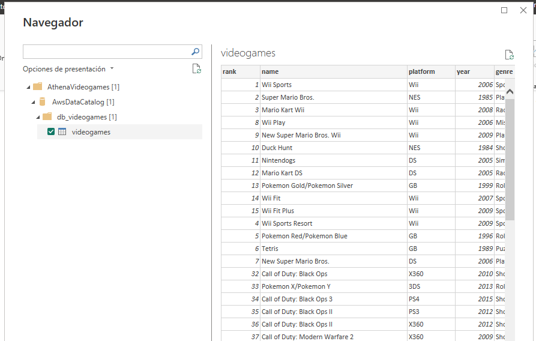

---

## Preguntas de negocio y hallazgos

### P1: Cuales son los 10 videojuegos mas vendidos de la historia?

Consulta: [`sql/query1_top10_global_sales.sql`](sql/query1_top10_global_sales.sql)

Wii Sports lidera con 82.74 millones de unidades vendidas globalmente, seguido por Super Mario Bros. (40.24M) y Mario Kart Wii (35.82M).

---

### P2: Que generos generan mas ventas por region (NA, EU, JP)?

Consulta: [`sql/query2_sales_by_genre_region.sql`](sql/query2_sales_by_genre_region.sql)

Action domina en todas las regiones. Role-Playing tiene una presencia significativamente mayor en Japon comparado con America del Norte y Europa, lo que refleja preferencias culturales diferenciadas.

---

### P3: Que publishers dominaron el mercado por decada?

Consulta: [`sql/query3_publishers_by_decade.sql`](sql/query3_publishers_by_decade.sql)

Nintendo ha mantenido el liderazgo en todas las decadas. Electronic Arts y Activision ganaron participacion significativa a partir de los 2000s. La decada del 2000 representa el pico historico de ventas del mercado.

---

## Visualizaciones

Las tres visualizaciones fueron construidas en Power BI Desktop usando consultas SQL nativas a Athena como fuente de datos.

**Top 10 Videojuegos por Ventas Globales**
Grafico de barras horizontales con los 10 titulos de mayor volumen de ventas globales.

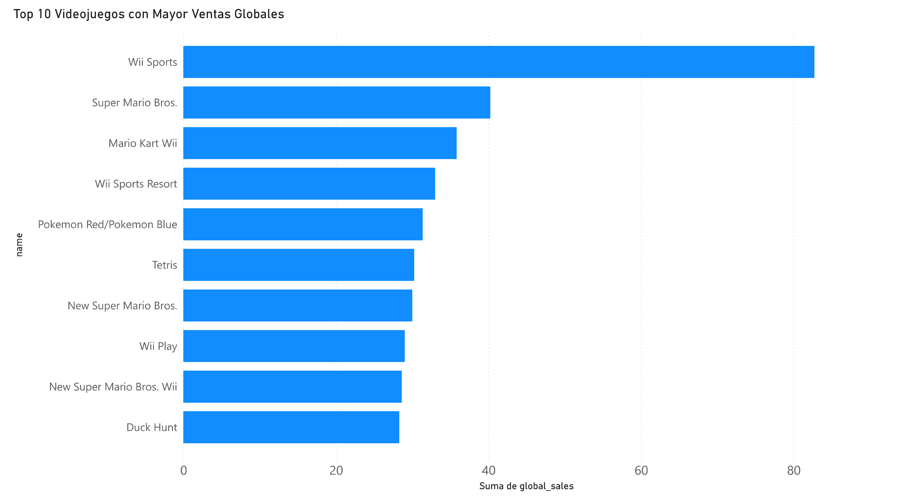

**Ventas por Genero y Region**
Grafico de barras apiladas comparando ventas en NA, EU y JP por genero.

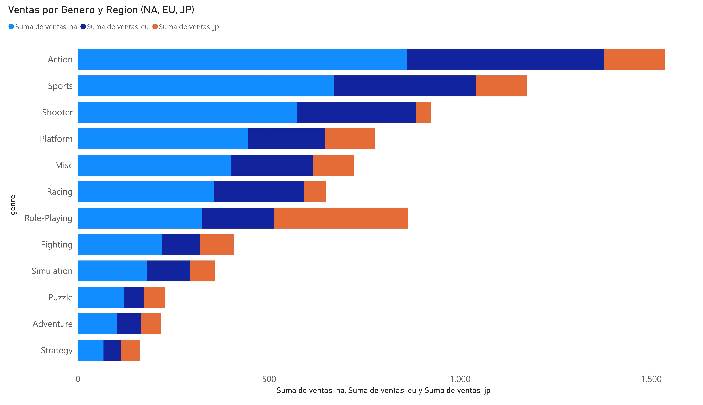

**Top Publishers por Decada**
Grafico de barras apiladas mostrando la evolucion del dominio comercial de los 5 principales publishers desde los 1980s hasta los 2010s.

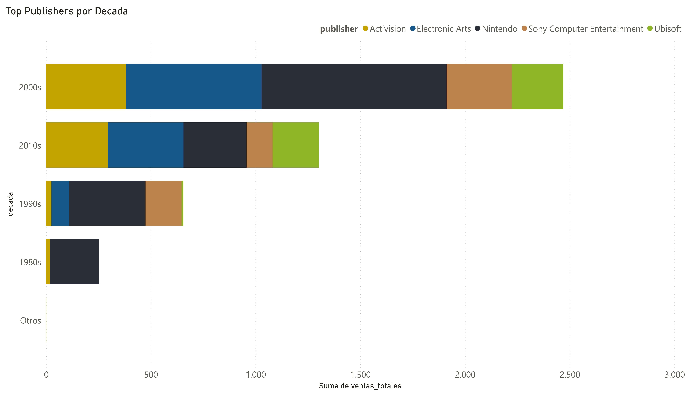

---

## Estimacion de costos (AWS Free Tier)

| Servicio        | Limite Free Tier              | Uso en este proyecto  |
|-----------------|-------------------------------|-----------------------|
| AWS Glue        | 44 DPU-horas/mes              | ~0.01 DPU-horas       |
| Amazon S3       | 5 GB de almacenamiento        | < 1 MB                |
| Amazon Athena   | 5 GB escaneados/mes           | < 5 MB por consulta   |
| Secrets Manager | 30 dias gratuitos por secreto | 1 secreto             |

Este proyecto corre completamente dentro de los limites del Free Tier de AWS.

---

## Estructura del repositorio

```
.
├── README.md
├── .gitignore
├── docs/
│   ├── iam-user-for-odbc.md           # Como crear el usuario IAM para la conexion ODBC
│   └── odbc-powerbi-setup.md          # Guia detallada de configuracion ODBC y Power BI
├── etl/
│   └── glue_job.py                    # Script del AWS Glue Job (Python Shell)
├── sql/
│   ├── query1_top10_global_sales.sql
│   ├── query2_sales_by_genre_region.sql
│   └── query3_publishers_by_decade.sql
└── images/
    └── (capturas del proceso y visualizaciones)
```

---

## Licencia

El codigo de este proyecto esta bajo la licencia [MIT](LICENSE). Puedes usarlo, modificarlo y distribuirlo libremente, incluso en proyectos propios, siempre que mantengas el aviso de copyright.

El dataset utilizado ([Video Game Sales](https://www.kaggle.com/datasets/gregorut/videogamesales)) es propiedad de su autor original en Kaggle y tiene su propia licencia independiente. Este proyecto no redistribuye el dataset, lo descarga en tiempo de ejecucion directamente desde la API de Kaggle.
